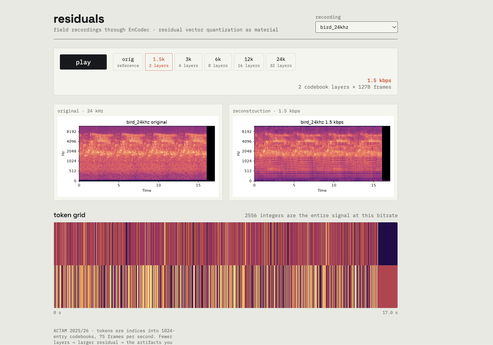

# residuals

**Field recordings through a neural audio codec — residual vector quantization as compositional material.**

Live demo: `[https://bianr233.github.io/actam--25/](https://bianr233.github.io/actam--25/)`  



## Summary
* [Concept](#concept)
* [Why EnCodec?](#why-encodec)
* [How residual vector quantization works](#how-residual-vector-quantization-works)
* [Architecture](#architecture)
* [Run locally](#run-locally)
* [Add your own recordings](#add-your-own-recordings)
* [Reading the token grid](#reading-the-token-grid)

## Concept

Neural audio codecs are trained to compress *human* signals — speech and music — as transparently as possible. This project asks what happens when a compression system built for human sounds encounters non-human ones: field recordings of birds, forests, environmental noise.

At high bitrates the reconstruction is near-transparent. As the bitrate drops, the codec is forced to describe the signal with fewer and fewer discrete symbols, and its failures become audible: smearing, phantom harmonics, texture collapse. Codec Explorer makes this degradation inspectable — you hear the reconstruction, and you simultaneously see the *entire* discrete representation it was decoded from.

The same low-bitrate artifacts serve as source material for an electroacoustic composition (in the tradition of Kim Cascone's "aesthetics of failure": glitch and microsound treat the residue of technical systems as musical substance).

## Why EnCodec?

[EnCodec](https://github.com/facebookresearch/encodec) (Meta, 2022) is a neural audio codec with an Encoder → RVQ → Decoder architecture. Two reasons it anchors this project:

1. **Its artifacts are musically interesting.** Compared to more recent codecs (e.g. DAC), EnCodec degrades earlier and more dramatically at low bitrates — which is exactly the material this project is after.
2. **It is the tokenization layer of audio language models.** MusicGen and VALL-E generate EnCodec tokens; the codec is the bridge between continuous audio and LLM-style discrete sequence modeling. Exploring its codes is exploring the vocabulary those models speak.

The 24 kHz mono variant is used at 5 bandwidth settings: 1.5, 3, 6, 12, 24 kbps.

## How residual vector quantization works

The encoder maps 24,000 samples per second down to **75 latent frames per second**. Each frame is a continuous vector that must become discrete. RVQ does this in layers:

1. Codebook 1 (1024 entries) finds the nearest entry to the frame vector and records its **index** — a single integer, the first token.
2. Quantization leaves an error (the *residual*). Codebook 2 quantizes that residual. Codebook 3 quantizes what's left, and so on.
3. The bitrate setting decides how many layers run: **1.5 kbps → 2 codebooks, 24 kbps → 32 codebooks.**

So a 23-second recording at 6 kbps becomes an integer matrix of shape `[8 layers × 1746 frames]` — roughly fourteen thousand table lookups, and *nothing else*. The decoder reconstructs the waveform from those indices alone. Everything the codec could not fit into that budget is what you hear as artifact.

## Architecture

Fully static — no backend, no runtime inference. Heavy computation happens once, offline:

```
scripts/encode.py  (Python, offline)          browser (static)
─────────────────────────────────    ────────────────────────────────
wav → EnCodec encode/decode      →   assets/audio/*.wav      → Web Audio A/B
    → codes tensor dump          →   assets/tokens/*.json    → canvas heatmap
    → mel spectrograms           →   assets/spectrograms/*.png
    → manifest.json              →   drives the sample list
```

Playback detail: **all variants of a sample play simultaneously** through per-variant `GainNode`s; switching bitrate only flips gains (8 ms ramp). The comparison is therefore perfectly time-aligned and click-free — you audition the quantization, not a restart.

## Run locally

```bash
python3 -m venv .venv && source .venv/bin/activate
pip install torch encodec librosa soundfile matplotlib
python3 -m http.server 8000        # then open http://localhost:8000
```

## Add your own recordings

```bash
source .venv/bin/activate
python scripts/encode.py path/to/recording1.wav path/to/recording2.wav
```

Keep clips ≤ 30 s (CPU inference over 5 bitrates). The script regenerates `assets/manifest.json` from the files passed on the command line, so list **every** sample you want visible.

## Reading the token grid

Horizontal axis: time (75 frames/s). Vertical axis: codebook layers — top row is the coarse first codebook, lower rows are successive residual refinements. Color: the token index (0–1023) at that position. Switch from 1.5 to 24 kbps and watch the grid grow from 2 rows to 32: the visual density *is* the information budget, and the red playhead shows which column of integers you are hearing at every instant.

---

*ACTAM 2025/26 · Politecnico di Milano*